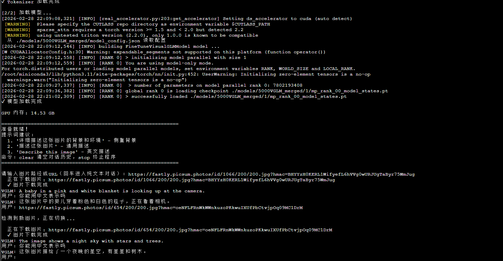

# VGLM

VisualGLM-6B 模型微调版，支持 LoRA 和 QLoRA 微调技术，实现对多模态大模型的轻量化训练和部署。

## 项目简介

VGLM 是基于 [VisualGLM-6B](https://github.com/THUDM/VisualGLM-6B) 的图像描述模型微调版本，通过 LoRA 技术合并训练权重，实现对模型的微调。本项目支持：

- **LoRA 微调**：低秩适应微调，减少显存占用
- **QLoRA 微调**：4-bit 量化 + LoRA，进一步降低显存需求
- **模型量化**：支持 4-bit / 8-bit 量化推理
- **多框架支持**：同时支持 SAT (SwissArmyTransformer) 和 HuggingFace Transformers 框架

## 为什么使用 LoRA 技术微调？

### 为什么要微调？

VisualGLM-6B 是一个通用的视觉语言模型，但在特定任务上可能表现不佳。通过微调可以：

- **领域适配**：让模型更好地理解特定领域的图片（如医学影像、工业检测、卫星图像等）
- **任务定制**：优化模型在特定任务上的表现（如图像描述风格、问答格式等）
- **语言优化**：增强模型在中文场景下的表达能力和准确性
- **行为矫正**：修正模型的不良输出倾向，如幻觉、不准确描述等

### 为什么选择 LoRA？

LoRA（Low-Rank Adaptation，低秩适应）是一种参数高效微调技术，相比全量微调有以下优势：

| 对比项 | 全量微调 | LoRA 微调 |
|--------|----------|-----------|
| 训练参数 | 60亿参数全部更新 | 仅更新 0.1%~1% 的参数 |
| 显存占用 | 40GB+ | 16GB+ |
| 训练速度 | 慢 | 快 3~5 倍 |
| 存储成本 | 每次微调保存完整模型（12GB+） | 仅保存 LoRA 权重（几十MB） |
| 多任务支持 | 每个任务一个完整模型 | 多个 LoRA 可灵活切换 |

**工作原理**：LoRA 冻结预训练模型的权重，在 Transformer 层中注入可训练的低秩矩阵（A 和 B 矩阵），通过训练这些少量参数来实现模型适配。数学上，权重更新量 ΔW = A × B，其中 A 和 B 的秩远小于原始权重矩阵，从而大幅降低微调成本。

**适用场景**：
- 个人开发者或小团队，显存资源有限
- 需要在同一基础模型上训练多个任务
- 快速实验和迭代不同微调方案

> 📖 参考：[LoRA: Low-Rank Adaptation of Large Language Models](https://arxiv.org/abs/2106.09685)

## 环境要求

- Python >= 3.8
- PyTorch >= 2.0.0
- CUDA >= 11.7 (推荐)
- 显存要求：
  - 训练：16GB+ (LoRA) / 12GB+ (QLoRA)
  - 推理：14GB+ (FP16) / 6GB+ (4-bit 量化)


## 安装依赖

```bash
pip install -r requirements.txt
```

## 项目结构

```
VGLM/
├── model/                      # 模型定义
│   ├── visualglm.py           # VisualGLM 模型实现
│   ├── chat.py                # 对话相关功能
│   ├── blip2.py               # BLIP2 视觉编码器
│   └── infer_util.py          # 推理工具函数
├── visualglm/                  # 基础模型文件
│   ├── config.json            # 模型配置
│   ├── modeling_chatglm.py    # ChatGLM 模型实现
│   └── tokenization_chatglm.py # 分词器
├── finetune/                   # 训练脚本
│   ├── finetune_visualglm.sh      # LoRA 训练脚本
│   └── finetune_visualglm_qlora.sh # QLoRA 训练脚本
├── finetune_visualglm.py      # 训练主程序
├── merge_lora.py              # LoRA 权重合并工具
├── prepare_coco_dataset.py    # COCO 数据集预处理
├── sat_VGLM.py                # SAT 框架推理脚本
├── hf_VGLM.py                 # HuggingFace 框架推理脚本
└── requirements.txt           # 依赖列表
```

## 快速开始

### 1. 准备数据

本项目以使用 COCO 数据集为例进行训练、微调，支持 Karpathy Split 格式：

```bash
python prepare_coco_dataset.py \
    --annotation /path/to/dataset_coco.json \
    --image_root /path/to/images \
    --output_dir ./coco_finetune \
    --max_samples 5000
```

### 2. 模型微调

#### LoRA 微调

```bash
bash finetune/finetune_visualglm.sh
```

#### QLoRA 微调 (显存不足时使用)

```bash
bash finetune/finetune_visualglm_qlora.sh
```

微调参数说明：
- `--lora_rank`: LoRA 秩，默认 10
- `--layer_range`: 指定微调的层范围，如 `0 14`
- `--pre_seq_len`: 前缀序列长度，默认 4
- `--train-iters`: 训练迭代次数
- `--lr`: 学习率，默认 0.0001

### 3. 合并 LoRA 权重

微调完成后，需要将 LoRA 权重合并到基础模型中：
这里以我用MSCOCO2014的5000个样本训练出来的权重mode 5000为例，合并后的模型为5000VGLM_merged

```bash
python merge_lora.py --mode 5000 --output ./models/5000VGLM_merged
```

### 4. 模型推理

#### 使用 SAT 框架推理

```bash
python sat_VGLM.py \
    --model_path ./models/merged_model \
    --quant 4  # 可选：4-bit 量化
```

#### 使用 HuggingFace 框架推理

我这里已经下好了除模型参数文件外的其他文件，项目默认使用本地 `./visualglm` 目录加载模型。如果该目录不存在，需要自己手动下载 `THUDM/visualglm-6b` 模型，我暂时没有把自动下载写进去。
完整的模型实现可以在[Hugging Face Hub](https://huggingface.co/THUDM/visualglm-6b)上下载。如果你从 Hugging Face Hub 上下载模型参数的速度较慢，可以从[这里](https://cloud.tsinghua.edu.cn/d/43ffb021ca5f4897b56a/)手动下载模型参数文件，并从本地加载模型。

```bash
python hf_VGLM.py
```

支持交互式对话，输入图片路径或 URL 即可进行图像问答。

## 使用示例

```python
from sat.model import AutoModel
from transformers import AutoTokenizer

# 加载模型
model, args = AutoModel.from_pretrained("./models/merged_model")
tokenizer = AutoTokenizer.from_pretrained("./visualglm", trust_remote_code=True)

# 推理
image_path = "path/to/image.jpg"
response, history = model.chat(tokenizer, image_path, "描述这张图片。")
print(response)
```

## 运行示例

### 示例 1：婴儿图片


**对话记录：**

```
用户: https://fastly.picsum.photos/id/1066/200/200.jpg

VGLM: A baby in a pink and white blanket is looking up at the camera.

用户: 你能用中文表示吗

VGLM: 这张图片中的婴儿穿着粉色和白色的毯子，正在看着相机。
```

### 示例 2：星空图片


**对话记录：**

```
用户: https://fastly.picsum.photos/id/654/200/200.jpg

VGLM: The image shows a night sky with stars and trees.

用户: 你能用中文表示吗

VGLM: 这张图片描绘了一个夜晚的星空，有星星和树木。
```

### 运行截图



**显存占用：** 约 14.53 GB（FP16 无量化模式）

## 模型特点

1. **轻量化训练**：使用 LoRA/QLoRA 技术，仅需训练少量参数
2. **中英文优化**：针对中英文图像描述任务优化
3. **量化支持**：支持 4-bit/8-bit 量化，降低部署成本

## 训练数据格式

微调所需的 JSON 格式：

```json
[
    {
        "img": "/path/to/image.jpg",
        "prompt": "描述这张图片。",
        "label": "这是一张包含...的图片。"
    }
]
```

## 许可证

本项目遵循 VisualGLM-6B 的开源许可证。详见 [visualglm/LICENSE](visualglm/LICENSE) 和 [visualglm/MODEL_LICENSE](visualglm/MODEL_LICENSE)。

## 致谢

- [VisualGLM-6B](https://github.com/THUDM/VisualGLM-6B) - 基础模型
- [ChatGLM-6B](https://github.com/THUDM/ChatGLM-6B) - 语言模型基座

## 相关链接

- [VisualGLM-6B GitHub](https://github.com/THUDM/VisualGLM-6B)
- [ChatGLM-6B GitHub](https://github.com/THUDM/ChatGLM-6B)
